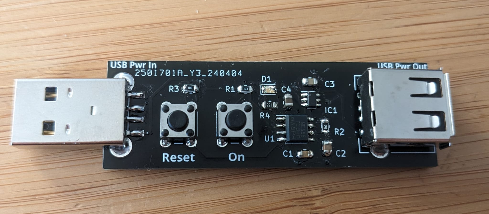
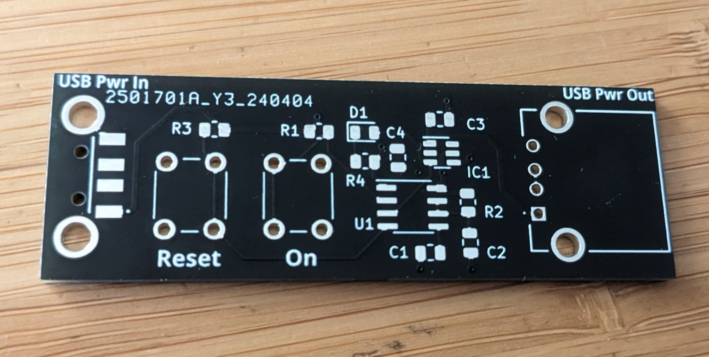

# USB-Monostable

- An in-line timer/monostable switch for 5 V USB power, with a PCB based around the [555 timer](https://www.ti.com/product/NE555) and [SiP32508 load switch](https://www.vishay.com/docs/62754/sip32508.pdf) ICs.



_Populated USB-Monostable PCB_

- Pressing the "On" button causes the switch between the input and output USB power lines to close, reopening after a customisable and fixed time period has elapsed.
- Pressing the "Reset" button causes the switch to immediately open.
- Optional indicator LED reflects the switch status.
- USB data lines are not passed through.
- Current draw when the switch is open is under than 1 mA at 5 V.
- Slim physical footprint (20 x 60 mm) allows the switch to be placed in-line, between a power supply and downstream device.
- Uses robust full-size USB-A 2.0 connectors: male for the input, female for the output.
- This is an open source hardware project: you can use the files in this repository to make your own switch, or modify the KiCAD PCB design as you see fit.



_Unpopulated USB-Monostable PCB_

## Usage

PCBs can be purchased from any fabricator by submitting the latest Gerber files from this repository (see the [Releases](https://github.com/tti0/USB-Monostable/releases) page). The footprints chosen (mostly SMD 0805) allow all components in the BOM to then be soldered by hand fairly easily. It is recommended to use lead-free solder of diameter 0.6 mm. 

The values of **R2** and **C2** may be adjusted to alter the time period (the length of time for which power is supplied to the output after the button is pressed) of the switch. Since this project uses the 555 timer, the standard monostable equation applies:

```
Time period (seconds) = R2 (Ohms) * C2 (Farads) * 1.1
```

The LED **D1** and its current-limiting resistor **R4** can be omitted during construction if a visual status indicator is not required.

### Bill of materials (BOM)

The USB connectors **J1** and **J2** are the only non-standard footprints in this project. Proprietary KiCAD footprints can be downloaded by following the links in the below table, but cannot be distributed with this project for licensing reasons.

Values of **R2** and **C2** listed here result in a time period of 39.6 seconds.

| Reference | Qty | Value                  | Footprint                           |
|-----------|-----|------------------------|-------------------------------------|
| C1        | 1   | 10 nF                  | Capacitor_SMD:C_0805_2012Metric     |
| C2        | 1   | 10 uF                  | Capacitor_SMD:C_0805_2012Metric     |
| C3        | 1   | 100 nF                 | Capacitor_SMD:C_0805_2012Metric     |
| C4        | 1   | 4.7 uF                 | Capacitor_SMD:C_0805_2012Metric     |
| D1        | 1   | LED (Green)            | LED_SMD:LED_0805_2012Metric         |
| IC1       | 1   | SIP32508DT-T1-GE3      | Package_TO_SOT_SMD:SOT-23-6         |
| J1        | 1   | USB_A (Input, male)    | [SamacSys_Parts:USB1061GFLA](https://www.mouser.co.uk/ProductDetail/640-USB1061-GF-L-A)          |
| J2        | 1   | USB_A (Output, female) | [SamacSys_Parts:USBASRA](https://www.mouser.co.uk/ProductDetail/737-USB-A-S-RA)              |
| R1, R3    | 2   | 10k                    | Resistor_SMD:R_0805_2012Metric      |
| R2        | 1   | 3M6                    | Resistor_SMD:R_0805_2012Metric      |
| R4        | 1   | 1k                     | Resistor_SMD:R_0805_2012Metric      |
| SW1       | 1   | SW_Push (Set)          | Button_Switch_THT:SW_PUSH_6mm       |
| SW2       | 1   | SW_Push (Reset)        | Button_Switch_THT:SW_PUSH_6mm       |
| U1        | 1   | NE555D                 | Package_SO:SOIC-8_3.9x4.9mm_P1.27mm |

## Licencing

This project is Copyright (c) tti0 2024, and licenced under the _CERN Open Hardware Licence Version 2 – Permissive_. Please see `LICENSE` for full details.
